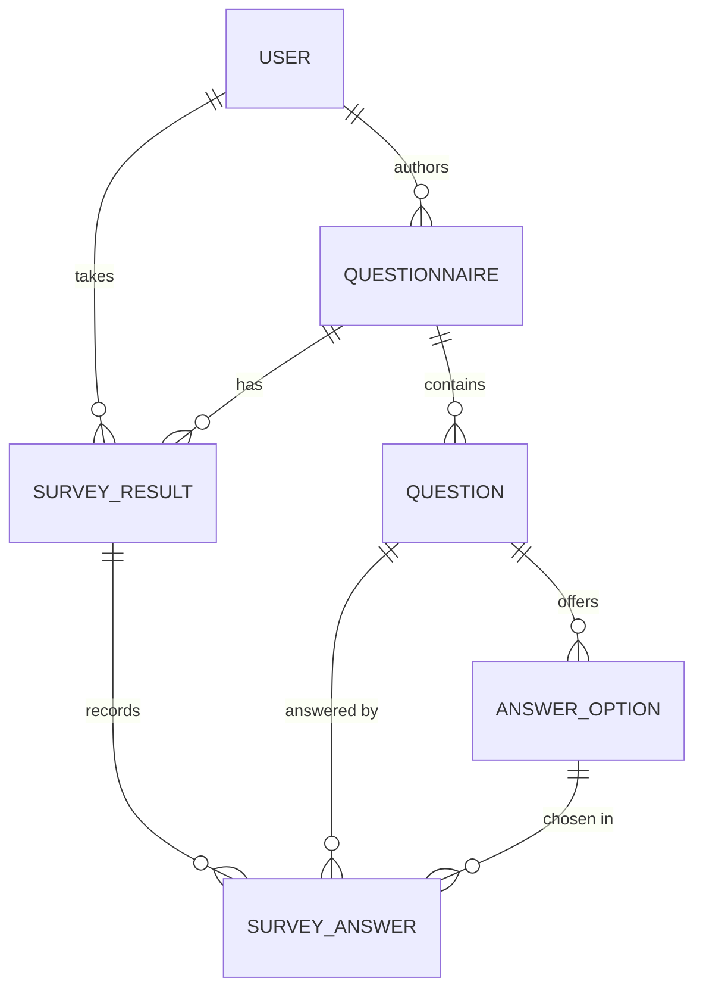

# Architecture

A survey service. **Authors** create, edit and publish surveys and read their
statistics; **readers** take published surveys. Django + DRF + PostgreSQL,
stateless JWT auth.

## Data model

| Table | PK | What it holds |
|---|---|---|
| `users_user` | bigint | Email-based user; `role` = reader / author |
| `questionnaires_questionnaire` | uuid7 | `title`, `author`, `is_published`, `question_order uuid[]` |
| `questions_question` | uuid7 | `text`, `allow_multiple`, `option_order uuid[]` |
| `questions_answeroption` | uuid7 | `text` |
| `results_surveyresult` | bigint | One per (respondent, survey); `started/completed_timestamp` |
| `results_surveyanswer` | bigint | One chosen option → result + question + option |

- **Primary keys** — content tables use time-ordered **UUIDv7** (unguessable yet
  index-friendly); the high-volume result/answer tables use compact `bigint`.
- **Ordering** — the display order of questions (and of each question's options)
  is stored as a `uuid[]` array on the parent, so reordering is a single-row
  `UPDATE` rather than renumbering many rows.
- **Publishing** freezes a survey: once `is_published`, all edits are rejected,
  which keeps a survey's questions — and therefore its statistics — consistent
  while readers are taking it.

## Indexes

| Table | Index | Serves |
|---|---|---|
| questionnaire | `(is_published, created_timestamp DESC)` | Public feed, newest first — index scan, no sort |
| questionnaire | `(author, is_published)` | An author's own drafts / published |
| questionnaire | `unique(lower(title), author)` | Case-insensitive title uniqueness per author |
| question / option | `unique(lower(text), parent)` | De-duplication within a parent |
| surveyresult | `unique(questionnaire, respondent)` | One run per user; per-survey response counts |
| surveyanswer | `(question, option)` | Statistics tally — index-only aggregation |
| surveyanswer | `unique(result, question, option)` | De-dup; "which questions this user answered" (index-only) |

Redundant single-column foreign-key indexes are disabled (`db_index=False`)
wherever a composite or unique index already covers the column as its leading
prefix. This keeps writes on the high-volume `surveyresult` / `surveyanswer`
tables light without losing any lookup path.

## Performance characteristics

- **Reader paths** (feed, next-question, answer submission) are index-backed and
  scoped to a single user, so their latency is a few milliseconds and does **not**
  depend on how popular a survey is.
- **Statistics** is the only endpoint whose cost grows with a survey's response
  volume: it aggregates every answer of that survey, i.e. it is **linear in the
  number of respondents**. The aggregation runs as an index-only scan, so a
  survey with an ordinary response volume returns in single-digit milliseconds;
  only surveys with very large response volumes reach hundreds of milliseconds.
  It is an author-only, low-frequency endpoint and can be made constant-time with
  incremental counters if that ever becomes necessary.

At scale — millions of surveys and billions of stored answers — reader latency
stays flat; only per-survey statistics scale with that one survey's responses.
